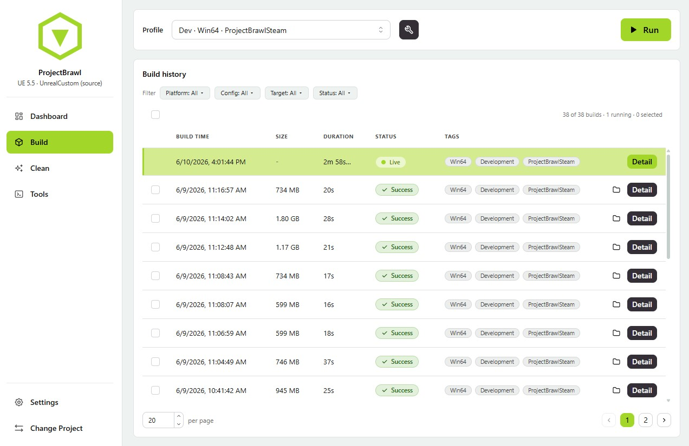
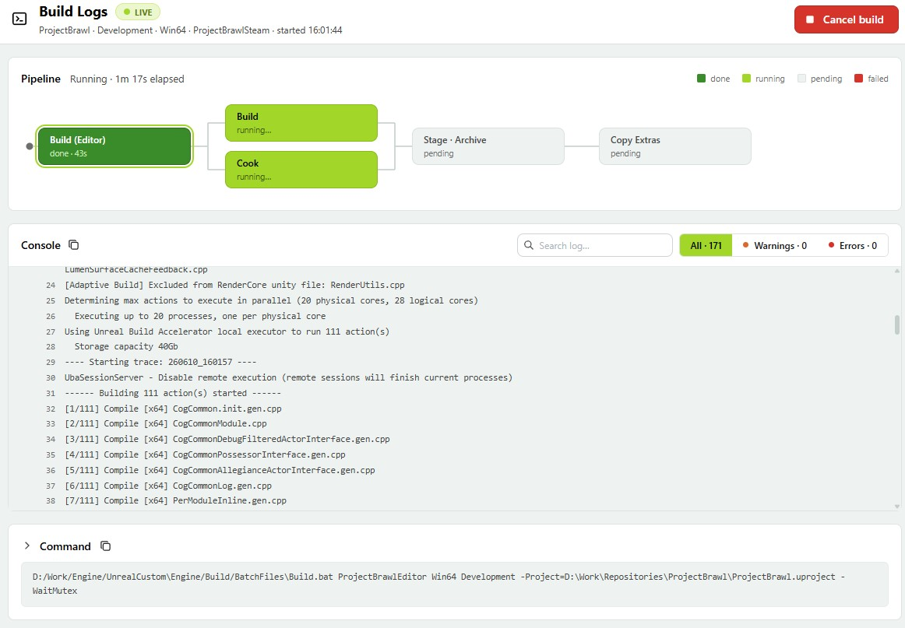

# UnrealEasyPackage

[](LICENSE)
[](https://www.rust-lang.org/)
[](https://tauri.app/)
[](#)

> UnrealEasyPackage is a lightweight tool for solo developers and small teams who find Unreal's packaging process vague and cumbersome. At this scale, hosting a dedicated CI/CD pipeline is overkill so instead, anyone on the team can run a build on their own using shared build settings, along with other tools that streamline day-to-day development.





## Why

- **Reusable, not fragile.** Save a tuned build profile instead of re-editing a wall of UAT flags every time.
- **See the footprint.** A single Development build can scatter ~38 GB of regenerable artifacts. Scan it, understand it, reclaim it.
- **Whole loop, one window.** Build, cook, stage, archive, inspect history, package plugins, and clean up - without leaving the app.

## Features

- **Build profiles** - save platform / target / configuration / phase toggles per profile, then pick and Run.
- **Environment auto-detection** - resolves the engine from the project's association, lists targets and maps for you.
- **Live pipeline + logs** - watch Build / Cook / Stage / Archive run as a phase graph beside a streaming, searchable console.
- **Dashboard** - build size, duration, success rate, and warning/error trends over time.
- **Footprint cleanup** - a categorized scan of what's safe to delete; reclaim gigabytes in a click.
- **Build history** - every build with size, duration, status, and tags; reopen any output folder.
- **Plugin packaging** - point at a `.uplugin`, pick an engine, and run `BuildPlugin -rocket` (FAB-ready output).
- **Project tools** - run Resave and Validate commandlets in-app.
- **Settings & notifications** - light/dark theme, desktop build-finish notifications, system tray.

➡️ **[Screen-by-screen tour → docs/features.md](docs/features.md)**

## Download

Prebuilt binaries are attached to every [**release**](https://github.com/TeamBaconn/UnrealEasyPackage/releases). Open the latest release, expand **Assets**, and grab the one for your platform - no build tools needed:

- **Windows:** the `.exe` (NSIS) or `.msi` installer, or the no-install **`-windows-portable.zip`** (unzip and run - needs the WebView2 runtime, preinstalled on Windows 10/11).
- **macOS:** the `.dmg`.
- **Linux:** the `.AppImage` (portable) or `.deb`.

> Installers are unsigned, so Windows SmartScreen / macOS Gatekeeper may warn on first launch - choose *Run anyway* / *Open*.

## Build from source

**Prerequisites**

- [Rust](https://www.rust-lang.org/tools/install) (stable) and [Node.js](https://nodejs.org/) 18+
- Tauri 2 platform deps - see [Tauri prerequisites](https://tauri.app/start/prerequisites/) (Windows: WebView2 + MSVC build tools)
- An installed Unreal Engine (the app drives it; it does not bundle or distribute Unreal)

**Run**

```sh
npm install
npm run tauri dev      # dev build with HMR
npm run tauri build    # production installer (NSIS/MSI on Windows)
```

## Usage

📖 **[Full features usage → docs/features.md](docs/features.md)**

1. Open a `.uproject` (or a `.uplugin`).
2. Create or pick a build profile and tune which phases run.
3. Hit Run and watch the live pipeline + log stream.
4. Use the Clean tab to scan and reclaim the build footprint.

## Disclaimer

This application does not distribute, bundle, or modify Epic Games software. It drives a separately installed Unreal Engine via its own `RunUAT` tooling. Unreal Engine and its trademarks are property of Epic Games, Inc. You are responsible for complying with the Unreal Engine EULA.

## License

[MIT](LICENSE) (c) 2026 TeamBaconn
