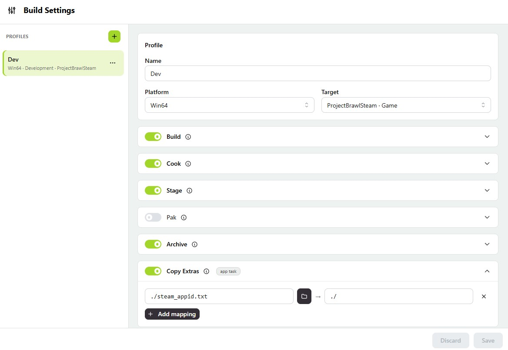
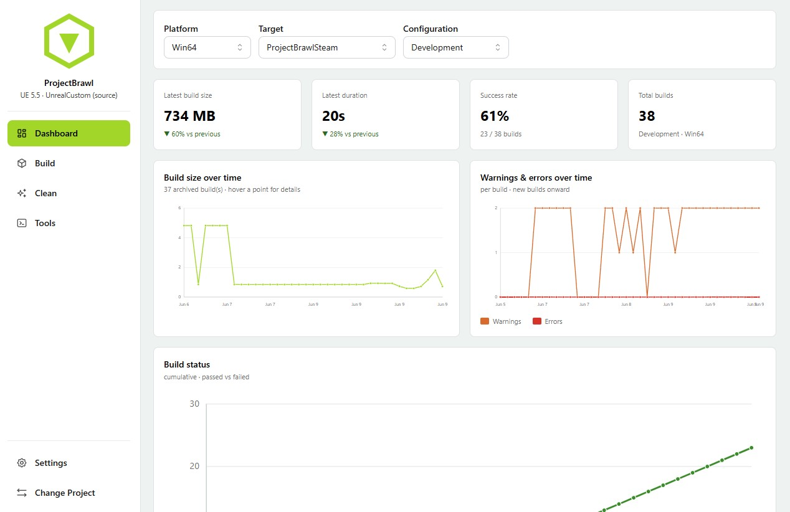
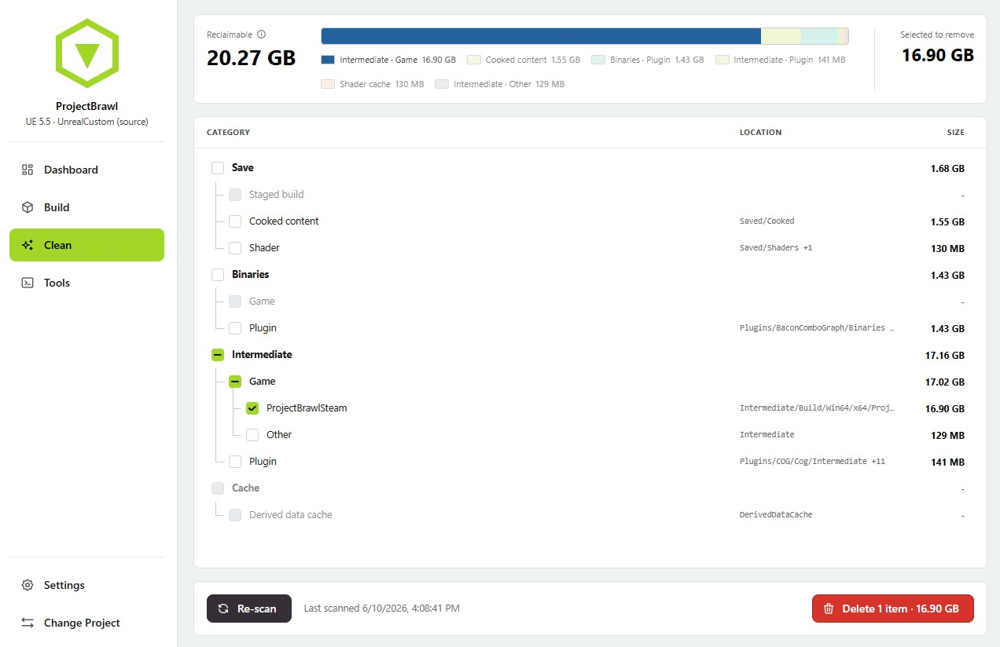
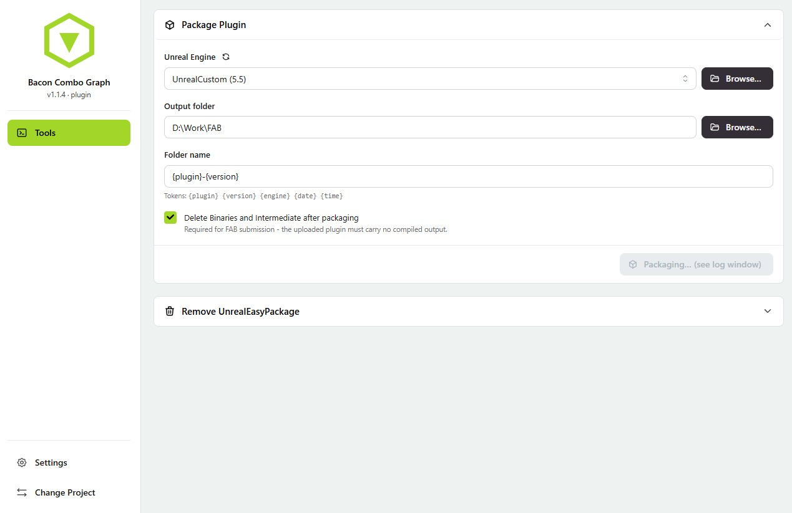
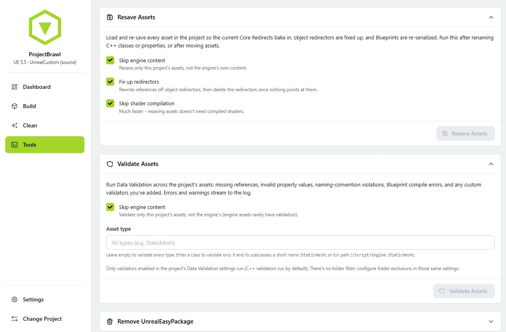

# Features - a screen-by-screen tour

A walk through what UnrealEasyPackage does and the actions on each screen. Every parameter in the app is labeled and self-explaining, so this focuses on the main features rather than each individual setting.

← back to the [README](../README.md)

## Build & run

The home of a project. Pick a saved profile from the dropdown and hit **Run**, or open the profile editor with the wrench. Below sits the full **build history** - filter by platform, config, target, or status, page through past runs, and open the output folder for any build.

## Build profiles

Profiles capture a whole package configuration: platform, target, one or more build **configurations** (tick Development *and* Shipping and both are built and staged into a single package), and which **phases** run (Build, Cook, Stage, Pak, Archive, Copy Extras, Steam upload, Clean-up). Toggle phases on or off, add file mappings for extras like `steam_appid.txt`, and save. Create as many profiles as you have build flavors.

## Live pipeline + logs

While a build runs, each phase shows up as a node in a **pipeline graph** (done / running / pending / failed) with per-phase timing. The streaming **console** below tints lines by severity, counts warnings and errors, and is searchable. The exact command that was launched is shown at the bottom. Cancel at any time.

## Publish to Steam

Turn on the **Steam upload** phase and the archived build ships straight to Steam via `steamcmd` - no separate ContentBuilder setup. Set your **App ID** and **depots** in the profile, then point the app at a `steamcmd.exe` and your Steam build account under **Setup SteamCMD**. There's no password field: the build opens steamcmd once so you sign in there (enter the Steam Guard code, or approve on your phone), and the cached session is reused after that - front-loaded before the build, so signing in never interrupts a finished package. Flip **Preview** on for a dry run that validates the upload without publishing. The phase requires Archive (there has to be a finished build to push), and the generated VDF scripts stay yours to hand-tune - any custom keys you add are preserved across saves.

## Dashboard

Trends across your builds for a chosen platform / target / configuration: latest build size and duration (with deltas), success rate, total builds, and charts for **build size over time**, **warnings & errors**, and cumulative **pass vs fail**.

## Footprint cleanup

A categorized scan of everything a build scatters across the project - staged builds, cooked content, shader caches, binaries, and per-target intermediates - with sizes and a reclaimable total. Tick the categories you want gone and delete them in one action. Safe-to-delete vs risky items are separated so you don't nuke something you need.

## Plugin packaging

Open a `.uplugin` instead of a project and you get a focused **Package Plugin** tool: pick the engine, set an output folder and a templated folder name, and run `BuildPlugin -rocket`. Optionally strip `Binaries` and `Intermediate` afterward so the output is ready for FAB submission. Live log streaming, same as a project build.

## Project tools

Run engine commandlets without leaving the app: **Resave Assets** (bake in Core Redirects, fix up redirectors, re-serialize Blueprints) and **Validate Assets** (run Data Validation across the project). Output streams to the run log just like a build.
